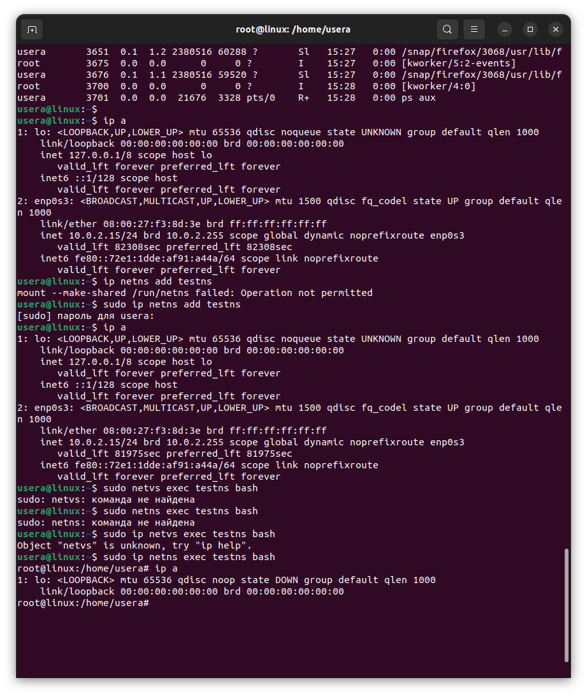
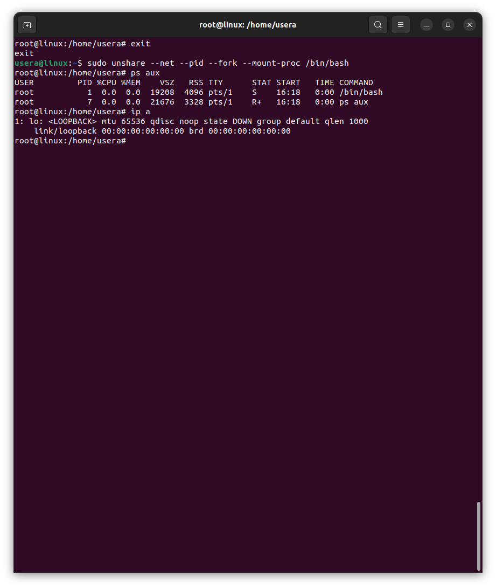

#### Задание: необходимо продемонстрировать изоляцию одного и того же приложения (как решено на семинаре - командного интерпретатора) в различных пространствах имен.

Создание изолированной области путем смены root. Пространнство будет пустым, поээтому необходимо вручную добавить необходимы скрипты и библиотеки.

Создание изолированной сети. Будет создано пространство с изолированной сетью, но не изолированным древом процессов.

Более глубокая изоляция как потрта так и дерева. 

