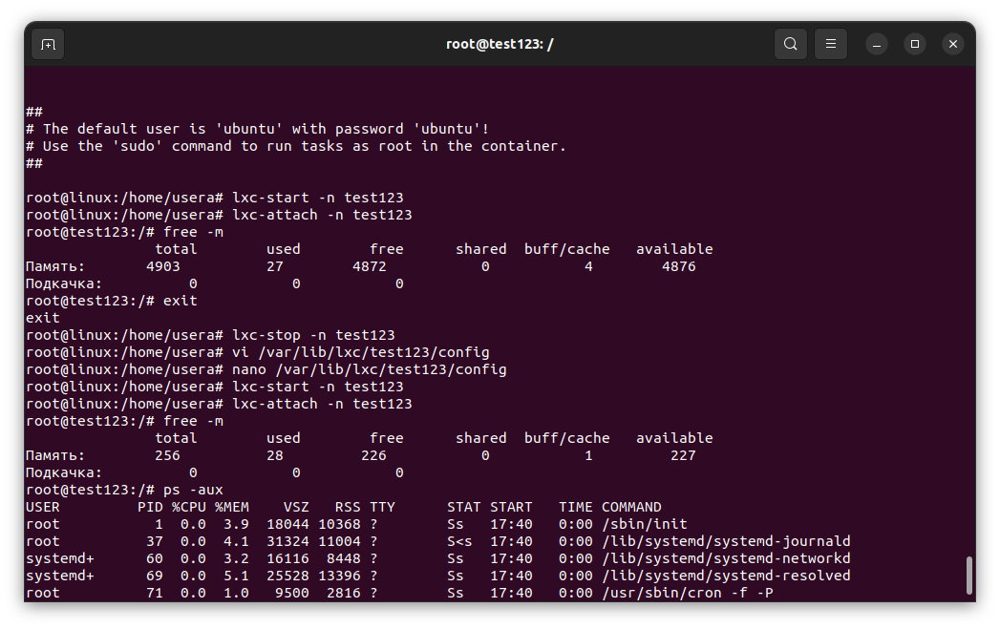
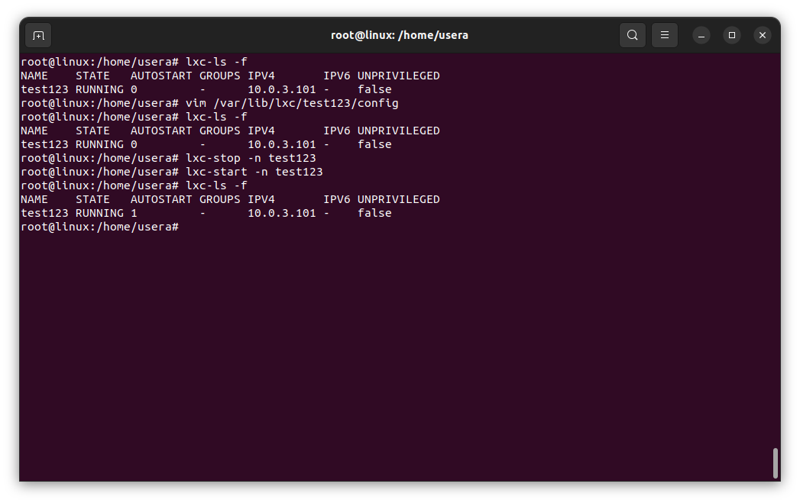

#### Задание:
1) запустить контейнер с ubuntu, используя механизм LXC
2) ограничить контейнер 256 Мб ОЗУ и проверить, что ограничение работает
Задание по желанию ..
4)добавить автозапуск контейнеру, перезагрузить ОС и убедиться, что контейнер действительно запустился самостоятельно

Как изменилась оперативка

Смена статуса автозапуска

